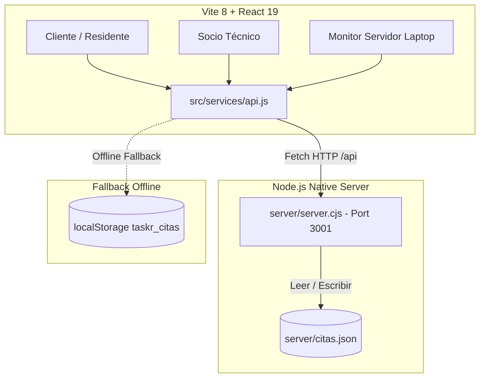

# 🛸 ANTIGRAVITY.md — Guía del Proyecto TASKR

Documento maestro de arquitectura, desarrollo y convenciones para la plataforma **TASKR** (Premium Artisan Service System). Este archivo sirve como guía contextual y directriz técnica para desarrolladores y agentes de IA en el entorno Antigravity.

---

## 📌 1. Visión General del Proyecto

**TASKR** es una aplicación web (PWA) de alto nivel orientada al mercado residencial de condominios de lujo en Costa Rica. Permite a los residentes solicitar y gestionar servicios técnicos y de mantenimiento artesanal (plomería, electricidad, cerrajería digital, etc.), conectando en tiempo real a clientes, socios técnicos y administradores.

### 🌟 Pilares del Proyecto:
- **Experiencia White-Glove:** Diseño pulido, refinado e intuitivo ("The Discerning Artisan").
- **Multi-Rol Dinámico:** Tres interfaces integradas en una sola app (`Cliente`, `Socio Técnico`, `Monitor Servidor`).
- **Arquitectura Portable USB / WLAN:** Diseñado para funcionar 100% offline o en red local sin conexión a internet durante presentaciones o zonas sin conectividad.
- **Sincronización Híbrida:** Backend Node.js ligero con respaldo transparente a `localStorage` si el servidor no está disponible.

---

## 📐 2. Arquitectura del Sistema



### Stack Tecnológico:
- **Frontend:** React 19, Vite 8, TailwindCSS v4 (`@tailwindcss/vite`), Lucide Icons (`lucide-react`).
- **Backend:** Node.js (Módulo HTTP nativo + `node:sqlite` nativo para máxima portabilidad).
- **Base de Datos:** **SQLite (`server/taskr.db`)** administrada mediante `server/database.cjs`.
- **Persistencia:** Base de datos SQLite ligera + fallback automático a `localStorage`.


---

## 📂 3. Estructura del Proyecto

```
TASKR/
├── server/
│   ├── server.js / server.cjs # Servidor HTTP Node.js portátil (Puerto 3001)
│   └── citas.json             # Base de datos local persistente
├── src/
│   ├── components/            # Componentes UI reutilizables
│   │   ├── Header.jsx         # Cabecera con selector de comunidad y avatar
│   │   ├── BottomNav.jsx      # Navegación inferior fija de 4 pestañas
│   │   ├── HandymanCard.jsx   # Tarjeta de técnico destacado / servicio
│   │   ├── HandymanDetailModal.jsx # Perfil detallado y flujo de reserva
│   │   ├── BookingConfirmationModal.jsx # Confirmación con pase de caseta
│   │   ├── SolicitarCitaModal.jsx       # Formulario rápido de solicitud
│   │   ├── IncidentReportModal.jsx     # Reporte de incidentes de seguridad
│   │   └── ChatModal.jsx               # Chat en vivo Cliente <-> Técnico
│   ├── views/                 # Vistas principales según rol / navegación
│   │   ├── SearchView.jsx         # Búsqueda y exploración de artesanos
│   │   ├── BookingsView.jsx       # Gestión de citas del residente
│   │   ├── ProfileView.jsx        # Perfil del usuario y resumen
│   │   ├── SettingsView.jsx       # Ajustes, tema oscuro y seguridad
│   │   ├── HandymanPartnerApp.jsx # Panel exclusivo del Socio Técnico
│   │   └── ServerMonitorView.jsx  # Panel de monitorización para la laptop
│   ├── services/
│   │   └── api.js             # Cliente HTTP con fallback a LocalStorage
│   ├── data/
│   │   └── mockData.js        # Datos iniciales (clientes, técnicos, citas)
│   ├── App.jsx                # Controlador de estado principal y ruteo de roles
│   ├── App.css / index.css    # Variables del sistema de diseño y Tailwind
│   └── main.jsx               # Punto de entrada React DOM
├── DESIGN.md                  # Especificación del Sistema de Diseño (Modo Claro)
├── DESIGN Dark mode.md        # Especificación del Sistema de Diseño (Modo Oscuro)
├── INICIAR_TASKR.bat          # Lanzador automático USB / WLAN para presentaciones
├── vite.config.js             # Configuración de Vite con Proxy HTTP /api
└── package.json               # Dependencias y scripts
```

---

## 🎭 4. Sistema Multi-Rol (Role Switching)

La aplicación detecta el rol mediante el parámetro de consulta `?role=` en la URL:

| Parámetro URL | Rol / Vista | Descripción |
| :--- | :--- | :--- |
| `?role=client` (default) | **Cliente Residente** | Explora artesanos, solicita servicios, recibe pases de seguridad y monitorea el estado del técnico. |
| `?role=handyman` | **Socio Técnico** | Recibe solicitudes entrantes, acepta trabajos, notifica llegada a caseta y cobra/finaliza servicios. |
| `?role=server` o `?role=supervisor` | **Supervisor / Monitor Laptop** | Panel de administración en vivo. Asigna técnicos a pedidos, cambia estados en tiempo real, filtra citas y monitorea la salud de la red WLAN. |


---

## 🎨 5. Sistema de Diseño ("The Discerning Artisan")

Definido minuciosamente en [`DESIGN.md`](file:///C:/Users/aarop/Documents/TASKR/DESIGN.md) y [`DESIGN Dark mode.md`](file:///C:/Users/aarop/Documents/TASKR/DESIGN Dark mode.md).

### Paleta de Colores Principal:
- **Verde Esmeralda Profundo (`#033028` / `#1e463e`):** Identidad principal, botones de acción, encabezados.
- **Arena / Mostaza (`#e5a93c`):** Acentos de alto valor (Insignias de Verificado, estrellas de valoración, badges).
- **Gris Superficie (`#f4f6f4` / `#f0eded`):** Fondo suave y descansado.
- **Negro Mate (`#1a1a1a` / `#1c1b1b`):** Tipografía principal e iconos.
- **Modo Oscuro (`#0b0e0d` / `#121614` / `#1a201d`):** Elegancia nocturna de alto contraste.

### Tipografía:
- **Fuente:** **Plus Jakarta Sans** (cargada mediante Google Fonts).
- **Estilo:** Geometría moderna, bordes suavizados, jerarquía clara en titulares y etiquetas metadata.

---

## 🔌 6. API REST Endpoints (`server/server.cjs`)

El backend expone una API REST ligera proxyada mediante Vite `/api`:

- `GET /api/health`: Estado del servidor y hora actual.
- `GET /api/citas`: Obtiene la lista completa de citas.
- `GET /api/tecnicos`: Lista de técnicos y disponibilidad.
- `POST /api/citas`: Crea una nueva cita de servicio (genera ID `CIT-xxxx` y código de caseta `TASKR-xxxx`).
- `PATCH /api/citas/:id`: Actualiza el estado (`Pendiente`, `Asignada`, `En Camino`, `Completada`, `Cancelada`) o asigna un técnico.

---

## 🚀 7. Ejecución y Despliegue Portable (USB / WLAN)

### Desarrollo Local Standard:
```bash
# Iniciar servidor frontend Vite
npm run dev

# En otra terminal, iniciar el backend Node
node server/server.cjs
```

### Modo Presentación USB / Sin Internet:
Ejecutar el archivo batch **`INICIAR_TASKR.bat`**. Este script automatiza:
1. Identifica la IP local de la computadora en la red Wi-Fi (`IPv4`).
2. Inicia el backend en `http://localhost:3001`.
3. Inicia Vite expuesto en la red (`0.0.0.0:5173`).
4. Abre automáticamente en la laptop la vista Monitor (`http://localhost:5173/?role=server`).
5. Imprime las URLs para conectar teléfonos móviles vía Wi-Fi o Hotspot.

---

## 🛠️ 8. Guía de Trabajo para Agentes e Ingenieros

1. **Preservación del Fallback:** Toda nueva interacción con la API en `src/services/api.js` debe mantener el bloque `try/catch` con fallback a `localStorage`.
2. **Consistencia Visual:** Mantener la estética premium en cada componente. Usar tokens HSL / Tailwind definidos y evitar componentes genéricos.
3. **Optimización Móvil:** Garantizar que las modales, botones y paneles se adapten sin desbordamiento tanto en vista enmarcada (`isMobileFrameView`) como en pantallas reales.
4. **Verificación de Cambios:** Tras realizar modificaciones en frontend o backend, verificar compillación con `npm run build` o `npm run lint`.
